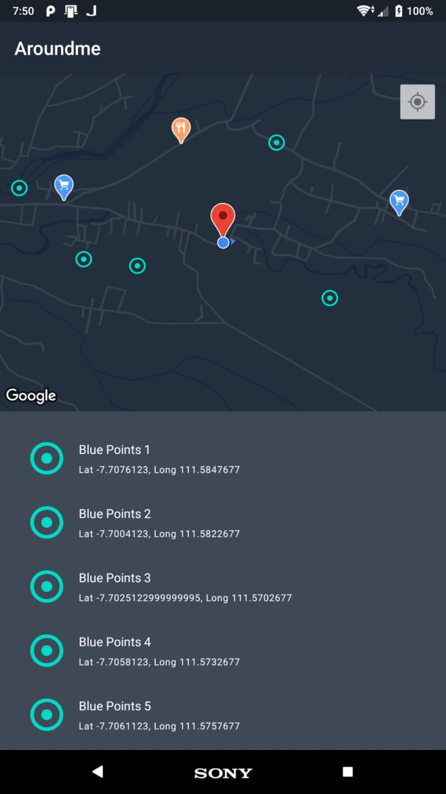

## Aroundme

## Library References

This repository contains Aroundme apps with:

1. MVVM with Architecture Components
2. Repository with mock API
3. Koin (For Dependency Injection)
4. RxJava 2
5. Android ViewBinding
6. ktlint (Kotlin Style Guide Static Code Analysis Tool)
7. Unit test:
   - MockK (For mocking objects and verifying stubs)
   - Truth (For making more readable assertions)
   - AndroidX Testing (For accessing Test helpers to test LiveData)

## Project Structure

- ``/data`` (contains data processing / repositories)
- ``/di`` (contains object dependencies for injection)
- ``/ui`` (contains all views)
- ``/utils`` (contains tools that are used)

## Android Architecture Components

The implementation of this project uses the MVVM (Model-View-ViewModel) architecture pattern based on the Android Architecture Components from Google Developers. References can be found at https://developer.android.com/topic/libraries/architecture

A full explanation is available at https://developer.android.com/jetpack/docs/guide
